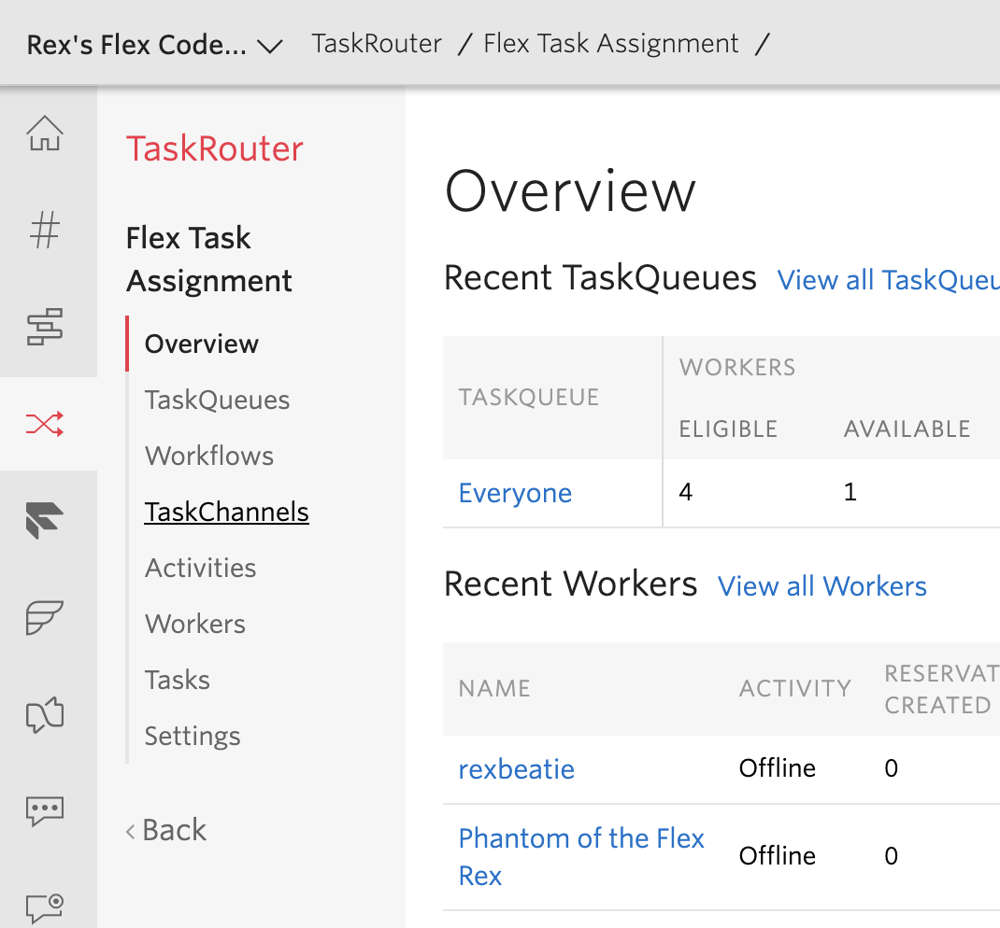

# Custom Icons for TaskListItems

# TaskListItem
[https://media.twiliocdn.com/sdk/js/flex/releases/1.16.0/docs/TaskListItem.html](https://media.twiliocdn.com/sdk/js/flex/releases/1.16.0/docs/TaskListItem.html) 

## Defining A Voicemail Channel

### Where do I place the definition? 

You will may want to place this before the app initializes. Here we placed it inside of the plugins `init(flex, manager)` method. 
 
### Task Channel Definition

```jsx harmony
// define a new default channel definition

    const definition = flex.DefaultTaskChannels.createDefaultTaskChannel(
      'voicemail',
      (task) => {
        return task.taskChannelUniqueName === 'voicemail';
      }, 
      "Hangup",
      "HangupBold",
      "#d2a926" // MarryGold
    );

    // register the definition
    
    flex.TaskChannels.register(definition);
```

# What Icons can I use?

You can use any of the listed [Flex Icons List](https://www.twilio.com/docs/flex/ui-icons)
 or create a custom icon and provide the JSX instead odf a string. For example...
 
The icons used here are `Hangup` and `HangupBold`. You can also provide `<Icon icon="Hangup" />` or `<Icon icon="HangupBold" />`. 
This means you can use `<Icon icon="custom" />` as well which is detailed here: [https://www.twilio.com/docs/flex/ui-icons#create-custom-icons](https://www.twilio.com/docs/flex/ui-icons#create-custom-icons) 

# Create A Custom Task Channel

Please navigate to your TaskRouter Dashboard here: [https://www.twilio.com/console/taskrouter/](https://www.twilio.com/console/taskrouter/).

Select your workspace and then on the left nav link list, click on TaskChannels.

   

Now click the red Add ( + ) button and create a `voicemail` channel.

And done. :) 


# More Resources and Notes

## Chat vs Call vs Default

These all behave differently. For example: 

>Call channel definition uses callbacks to determine the icon and colors (based on call state and destination to render)

Find more on the channel types here: [https://www.twilio.com/docs/flex/task-channel-definition-api#creating-custom-channel-definitions-with-helper-functions](https://www.twilio.com/docs/flex/task-channel-definition-api#creating-custom-channel-definitions-with-helper-functions)


# Original Plugin READEME

# Your custom Twilio Flex Plugin

Twilio Flex Plugins allow you to customize the appearance and behavior of [Twilio Flex](https://www.twilio.com/flex). If you want to learn more about the capabilities and how to use the API, check out our [Flex documentation](https://www.twilio.com/docs/flex).

## Setup

Make sure you have [Node.js](https://nodejs.org) as well as [`npm`](https://npmjs.com) installed.

Afterwards, install the dependencies by running `npm install`:

```bash
cd 

# If you use npm
npm install
```

## Development

In order to develop locally, you can use the Webpack Dev Server by running:

```bash
npm start
```

This will automatically start up the Webpack Dev Server and open the browser for you. Your app will run on `http://localhost:8080`. If you want to change that you can do this by setting the `PORT` environment variable:

```bash
PORT=3000 npm start
```

When you make changes to your code, the browser window will be automatically refreshed.

## Deploy

Once you are happy with your plugin, you have to bundle it in order to deploy it to Twilio Flex.

Run the following command to start the bundling:

```bash
npm run build
```

Afterwards, you'll find in your project a `build/` folder that contains a file with the name of your plugin project. For example, `plugin-example.js`. Take this file and upload it into the Assets part of your Twilio Runtime.

Note: Common packages like `React`, `ReactDOM`, `Redux` and `ReactRedux` are not bundled with the build because they are treated as external dependencies so the plugin will depend on Flex to provide them globally.
